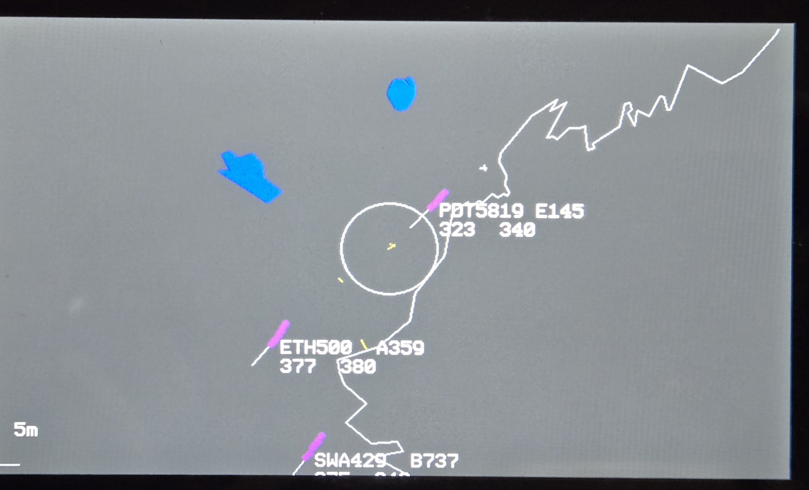
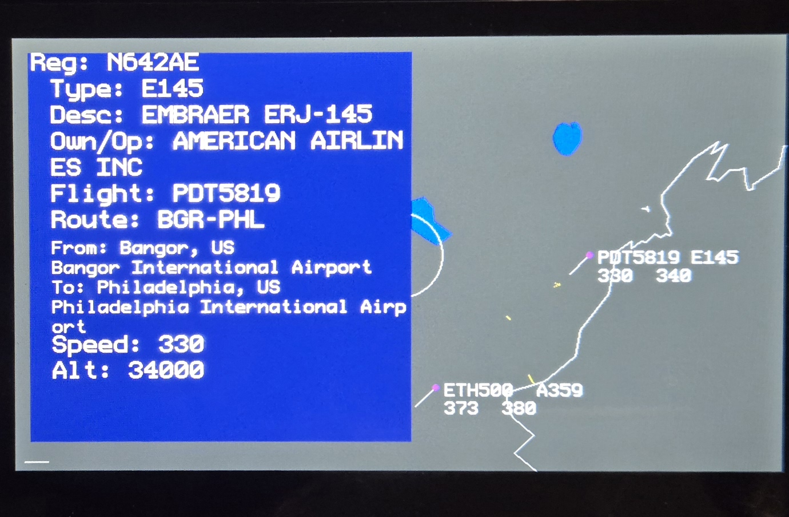

# Introduction 
This sketch loads ADSB data from a source and displays it on an ESP32 display. The example code uses a WaveShare 4.3 inch screen.
https://adsb.im/home is a great place to start to run your own ADSB receiver.

## Libraries
In addition to built-in libraries like WiFi and Http, this sketch requires these:

### Functional 
- ArduinoJson - Version 7.x https://arduinojson.org/
- U8g2lib - https://github.com/olikraus/u8g2 Version 2.35

### Hardware Specific
- Arduino_GFX_Library - Version v1.5.x https://github.com/moononournation/Arduino_GFX
- bb_touchcap - Version 1.2.x https://github.com/bitbank2/bb_captouch
- ESP32_IO_Expander - Version 1.0.x https://github.com/esp-arduino-libs/ESP32_IO_Expander
- ESP32_Display_Panel - Version 0.2.2 https://github.com/esp-arduino-libs/ESP32_Display_Panel

# Configuration
Edit the ESP32_adsb_display.ino file to set 
- your WiFi parameters, 
- the display parameters,
- the centerLat and centerLon to the latitude and longitude of your location
- the URL for your ADSB Source json file. **If you are using a public server, you need to set a limit on the returned data** For example:
`https://api.adsb.lol/v2/point/{lat}/{lon}/{radius}`   https://api.adsb.lol/v2/point/43/-70/50  centers on 43N, -70W with a radius of 50nm.  

If you are using a display other than the Waveshare 4.3 inch display, you will need to edit the configuration for Arduino_GFX, and the touch screen functions.

In the mapdata.cpp you need to define arrays for anything you want mapped on to the screen, e.g. coastlines, runways, lakes, political boundaries, etc. These are stored as sets of latitudes and longitudes. If you want to map a filled object, like a lake, the last set of coordinates should be the same as the first set. You can use an AI to get you sets of coordiantes for some features. This web site, https://www.keene.edu/campus/maps/tool/, can be used to manually create a set.
Each set of coordinates must also be added array "myMapSets" at the bottom of mapdata.cpp  See the example data for formatting.

# Function
Every 5 seconds, the program polls the ADSB server. Aircraft returned are displayed on screen, with their callsign or registration number, aircraft type, speed, and altitude (in hundreds of feet). 
There is a line that points in the direction the aircraft is moving. Each location is added to an array for 5 minutes. This array then displays the history of each aircraft. Aircraft tracks are color coded to height. See the array altitude_color_map for details. 

Touching the screen on an aircraft will center the display on that aircraft and open a side bar with detailed information. There is a brief lag when this opens because the route data is a separate http call. 
Touching the screen when the sidebar is open closes the sidebar and recenters the display on the default location.
Touching the screen where there is no aircraft cycles through 3 levels of zoom: 50, 20, or 5 statute mile radius. 
